# Autonomous Driving Dataset Paper Review

## 1. Zenseact Open Dataset (ZOD)
**Paper Information**  
- Title: Zenseact Open Dataset: A Large-Scale and Diverse Multimodal Dataset for Autonomous Driving  
- Conference: ICCV 2023  
- Authors: Mina Alibeigi, William Ljungbergh, Adam Tonderski, et al.  
- Link: [zod.zenseact.com](https://zod.zenseact.com)  

---

### Motivation
- Existing datasets (KITTI, nuScenes, Waymo, Argoverse2, etc.) **have limitations**:  
  - Restricted to a few cities or regions.  
  - Focus on **360° perception and short-term sequences**, lacking long-range scenarios.  
  - Limited sensor resolution and annotation distance, which is critical for high-speed driving.  

- **ZOD’s Goal**: Provide a **large-scale, high-resolution, diverse multimodal dataset** supporting **long-range perception**.

---

### Dataset Overview

#### Scale & Coverage
- Collected across **14 European countries** (from Sweden to Italy) over 2 years.  
- Coverage: **705 km²** (≈9× larger than Waymo).  
- Includes diverse conditions: day/night, urban/highway, sunny/rain/snow/fog.  

#### Dataset Splits
1. **Frames**  
   - 100k keyframes.  
   - Each keyframe includes ±1s LiDAR and 5s GNSS/IMU context.  
   - Fully annotated with detection, segmentation, and traffic signs.  

2. **Sequences**  
   - 1473 clips, each 20s.  
   - Suitable for **temporal tasks** like tracking and trajectory prediction.  

3. **Drives**  
   - 29 long sequences (minutes).  
   - For **localization, mapping, and SLAM**.  

#### Sensor Setup
- **Cameras**:  
  - Resolution: 8MP, 3848×2168, 120° FOV  
  - Frequency: **10 Hz**  
  - Storage format: **JPG** (default, lightweight), **PNG** (lossless, optional)  

- **LiDAR**:  
  - 1 × Velodyne VLS128 (range up to 245 m, ~254k points/frame) + 2 × VLP16  
  - Frequency: **10 Hz**  
  - Storage format: per-scan **`.npy`** files (containing 3D coordinates, intensity, timestamps, and sensor IDs)  

- **High-precision GNSS/IMU**:  
  - Accuracy: 0.01 m  
  - Frequency: **100 Hz**  
  - Storage format: **HDF5** (UTC time, WGS84/ECEF positions, attitude, velocity, acceleration, angular rates)  

- **Vehicle data (Sequences/Drives)**:  
  - Signals: steering wheel angle, accelerator/brake pedal ratios, turn indicators, plus consumer-grade IMU & satellite positioning  
  - Logging rates: vehicle control signals **100 Hz**, consumer-grade IMU **50 Hz**, satellite positioning **1 Hz**  
  - Storage format: **not explicitly specified in the paper**  

---

### Sensor Setup Visualization
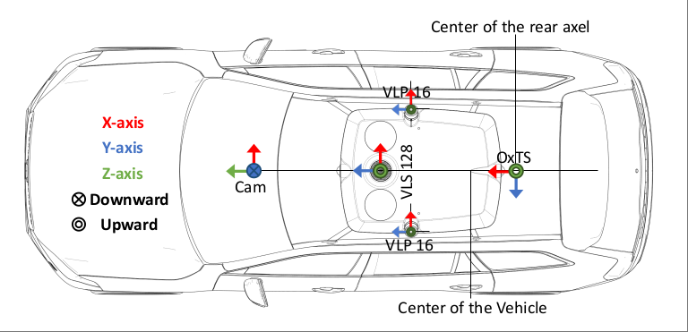
*Figure: Camera and LiDAR sensor mounting configuration.*

---

### Calibration and Coordinate Systems

- **Reference system**: All sensors are calibrated and synchronized with respect to the **ISO-8855 vehicle coordinate system**.  
- **Origin**: Fixed point relative to the vehicle chassis, located at the **center of the rear axle** under calibration load conditions.  
- **Axes convention**:  
  - X-axis → forward (vehicle heading)  
  - Y-axis → left (driver’s side)  
  - Z-axis → up (vertical)  
- **Calibration details**:  
  - Each datapoint provides **intrinsic** (sensor internal parameters) and **extrinsic** (pose relative to reference frame) calibration.  
  - Enables accurate transformation and alignment of data between any two sensors.  
- **Support tools**: The official **development kit** includes functions for coordinate transformations and projections.  

### Annotations

- **Annotation process**:  
  - All labels are manually created by skilled annotators using commercial tools.  
  - Each label passes through quality checks to ensure consistency and accuracy.  
  - Annotations are provided for both **Frames** and **Sequences**.

- **Categories of annotations**:  
  1. **Semantic / Instance Segmentation**  
     - Pixel-wise semantic segmentation masks with **15 top-level classes**.  
     - Instance segmentation for **lane markings**, with additional attributes such as **color** and **cardinality** (single or group of lanes).  
     - Covers lane markings, road paintings, and ego road (drivable area).  

  2. **2D / 3D Bounding Boxes**  
     - **2D bounding boxes**: tightly fitted to static and dynamic objects in camera images.  
     - **3D bounding boxes (9-DOF)**: for objects visible in both camera and LiDAR, described by:  
       - Box center (x, y, z)  
       - Dimensions (length, width, height)  
       - Quaternion rotation (qw, qx, qy, qz)  
     - **Hierarchical taxonomy**:  
       - Dynamic objects: 4 high-level classes → 16 subclasses  
       - Static objects: 7 high-level classes → 13 subclasses  
       - Traffic signs: 6 categories → **156 fine-grained classes** (largest traffic sign dataset to date)  
     - Objects are also labeled with attributes:  
       - **Generic**: occlusion rate  
       - **Class-specific**: e.g., is_electronic for traffic signs, emergency for vehicles  

  3. **Road Surface Classification**  
     - Labels for ego road condition, e.g., **wet, snowy, icy**.  
     - Used for road condition understanding and safety evaluation.  
---

### Example Annotations
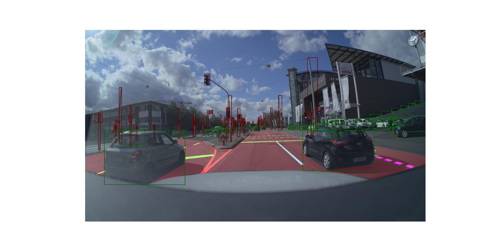
*Figure: Example of camera image with bounding boxes.*

---

### Scene Distribution
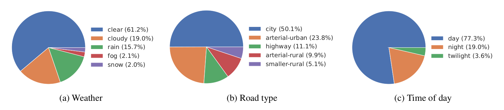
*Figure: Distribution of weather (a), road types (b), and time of day (c) in ZOD Frames.*

---

#### Privacy Protection
- Two anonymization methods:  
  - **Blurred**: traditional Gaussian blur.  
  - **DNAT (Deep Neural Anonymization Technique)**: GAN-based replacement, preserves pose/lighting.  
- Evaluation: Compared detection performance on **Faster R-CNN** and **YOLOv7** using original images vs. blurred vs. DNAT.  
- Results: Both anonymization methods introduced **negligible impact** on detection accuracy, confirming the dataset remains suitable for training and benchmarking.  

---

### Privacy Protection Examples
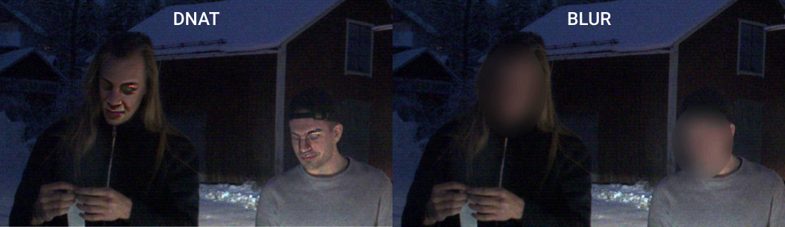  
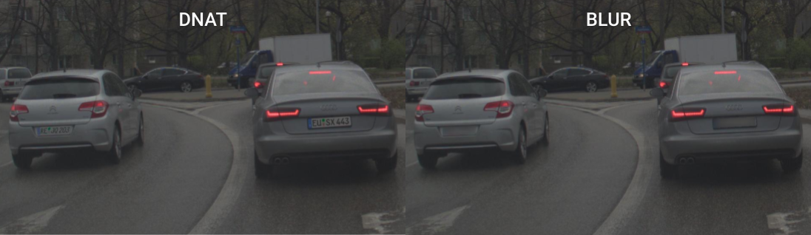  
*Figure: Privacy protection comparison. Top: faces, Bottom: license plates. Left: DNAT anonymization, Right: traditional blur.*  

---

#### License
- Released under **CC BY-SA 4.0** → free for **research and commercial use**.  

---

### Comparison with Other Datasets

| Dataset         | Locations              | Geo-coverage | Ann. frames | Sequences | Size (hr) | Ann. range | Avg. LiDAR points | Camera | Map |
|-----------------|------------------------|--------------|-------------|-----------|-----------|------------|--------------------|--------|-----|
| KITTI           | Karlsruhe              | -            | 15k*        | 22        | 1.5       | 91 m       | 120k               | 90°    | No  |
| nuScenes        | Boston, Singapore      | 5 km²        | 40k*        | 1000      | 5.5       | 141 m      | 34k                | 360°   | Yes |
| ONCE            | China                  | -            | 16k*        | 581       | **27.8**  | 81 m       | 65k                | 360°   | No  |
| PandaSet        | San Francisco          | -            | 8k*         | 103       | 0.2       | **300 m**  | 166k               | 360°   | No  |
| Waymo Open      | 6 U.S. cities          | 76 km²§      | **400k***   | **2030**  | 11.3      | 80 m       | 177k               | 360°   | No  |
| A2D2            | 3 German cities        | -            | 12k         | -         | -         | 103 m      | 7k                 | 360°   | No  |
| Argoverse 2     | 6 U.S. cities          | 17 km²       | 150k*       | 1000      | 4.2       | 214 m      | 107k               | 360°   | Yes |
| ZOD Frames  | **14 European countries**  | **705 km²**  | 100k   | -         | **55.6‡** | 245 m  | **254k**           | 120° | No |
| ZOD Seq.    | 6 European countries   | 26 km²   | -           | 1473  | 8.2   | 245 m  | **254k**           | 120° | No |
| ZOD Drives  | 2 European countries   | -            | -           | 29    | 1.5   | -          | **254k**           | 120° | No |

---

### Experiments & Analysis
1. **Long-range perception**  
   - Provides annotations up to **245m**.  
   - Performance of SOTA detectors (YOLOv7, Faster-RCNN) drops significantly at >150m → dataset offers new challenges.  

2. **Long-tail distribution**  
   - Includes rare categories (strollers, wheelchairs, polar bear warning signs).  
   - Performance on rare classes is low, highlighting the **importance of long-tail benchmarks**.  

3. **Anonymization impact**  
   - Detection accuracy on **blurred/DNAT images ≈ original images**.  
   - Confirms anonymization is feasible without loss of model performance.  

---

### Key Contributions
- Largest and most diverse **European autonomous driving dataset**.  
- High-resolution sensors enabling **245m long-range annotations**.  
- **446k traffic sign annotations** → largest to date.  
- Open license supporting both research and industry adoption.  
- Provides DevKit and example pipelines for easy integration.  

---

### Limitations
- Annotations are only for keyframes, not dense sequences.  
- 3D bounding box accuracy at very long range (>200m) is limited.  
- Some frames lack segmentation or traffic sign labels.  
- Anonymization impact on **behavior prediction tasks** is not fully studied.  

---

## 2. nuScenes (CVPR 2020)

**Paper Information**  
- Title: [nuScenes: A Multimodal Dataset for Autonomous Driving](https://arxiv.org/abs/1903.11027)  
- Conference: CVPR 2020  
- Authors: Holger Caesar, Varun Bankiti, Alex H. Lang, et al.  
- Organization: nuTonomy (an APTIV company)  
- DevKit & Leaderboard: [Official website](https://www.nuscenes.org/) | [GitHub DevKit](https://github.com/nutonomy/nuscenes-devkit)

---

### Motivation
- Earlier datasets focus mainly on **monocular or forward-facing cameras**, with limited coverage of **360° perception**, **multi-modal fusion (camera + LiDAR + radar)**, and **nighttime/adverse weather**.  
- nuScenes aims to:  
  - Provide a **full 360° sensor suite** (cameras, LiDAR, radars, GNSS/IMU).  
  - Cover **day/night, sunny/rainy conditions**.  
  - Release a **semantic high-definition map**.  
  - Introduce **new evaluation metrics** (Center Distance AP, NDS, sAMOTA, etc.) that better capture real autonomous driving needs.

---

### Dataset Overview

#### Scale & Coverage
- **1000 scenes**, each 20 seconds long.  
- **≈40,000 keyframes** at 2 Hz, annotated.  
- **≈1.4M 3D bounding boxes** in total.  
- Data collected in **Boston** and **Singapore**, across residential, industrial, natural areas, intersections, and construction zones.  
- **Diversity**: ~19% rainy, ~12% nighttime. Strong long-tail effect (rare categories appear 10,000× less than common ones).

#### Sensor Setup
The nuScenes dataset employs a **full 360° multimodal sensor suite**, mounted on two Renault Zoe vehicles with identical configurations, ensuring data consistency across locations (Boston and Singapore). The setup includes cameras, LiDAR, radars, GNSS/IMU, and CAN bus signals, all tightly synchronized.

- **6 × RGB Cameras**  
  - Resolution: 1600 × 900 pixels  
  - Frame rate: 12 Hz  
  - Sensor: 1/1.8" CMOS, auto-exposure, JPEG compression  
  - Field of View (FOV):  
    - Front and side cameras: ~70° horizontal FOV, offset by 55°  
    - Rear camera: ~110° horizontal FOV  
    - Together: full **360° surround coverage**  
  - Synchronization: Each camera exposure is triggered by the LiDAR sweep crossing its center FOV, ensuring temporal alignment.  

- **1 × Spinning 32-beam LiDAR**  
  - Type: Mechanical spinning LiDAR (Velodyne HDL-32E equivalent)  
  - Capture frequency: 20 Hz (20 full rotations per second)  
  - Field of View: 360° horizontal, vertical range −30° to +10°  
  - Range: up to 70 m  
  - Accuracy: ±2 cm  
  - Point density: up to 1.4 million points per second  
  - Role: Provides high-precision 3D geometry for localization, detection, and mapping.  

- **5 × FMCW Radars**  
  - Placement: front, rear, left-front, right-front, and rear-center, achieving near-complete surround coverage  
  - Frequency: 77 GHz FMCW (Frequency-Modulated Continuous Wave)  
  - Capture frequency: 13 Hz  
  - Range: up to 250 m  
  - Velocity accuracy: ±0.1 km/h via Doppler effect  
  - Robustness: Performs reliably in rain, fog, and low-visibility conditions, complementing LiDAR’s shorter range.  

- **GNSS + IMU (Inertial Navigation System)**  
  - Components: GPS, IMU, AHRS (Attitude and Heading Reference System)  
  - Positioning: RTK corrections, accuracy ≈ 2 cm  
  - Orientation accuracy:  
    - Heading ≤ 0.2°  
    - Roll/Pitch ≤ 0.1°  
  - Update rate: 1000 Hz  
  - Localization: Combines LiDAR-based Monte Carlo Localization (MCL) with odometry for robustness in urban canyons, achieving ≤ 10 cm localization error.  

- **CAN Bus**  
  - Provides detailed vehicle dynamics and control signals, including:  
    - Velocity, acceleration, wheel speeds  
    - Torque and braking state  
    - Steering angle  
  - Enables correlation of ego-vehicle motion with perception data.  

#### Sensor Mounting Layout  
  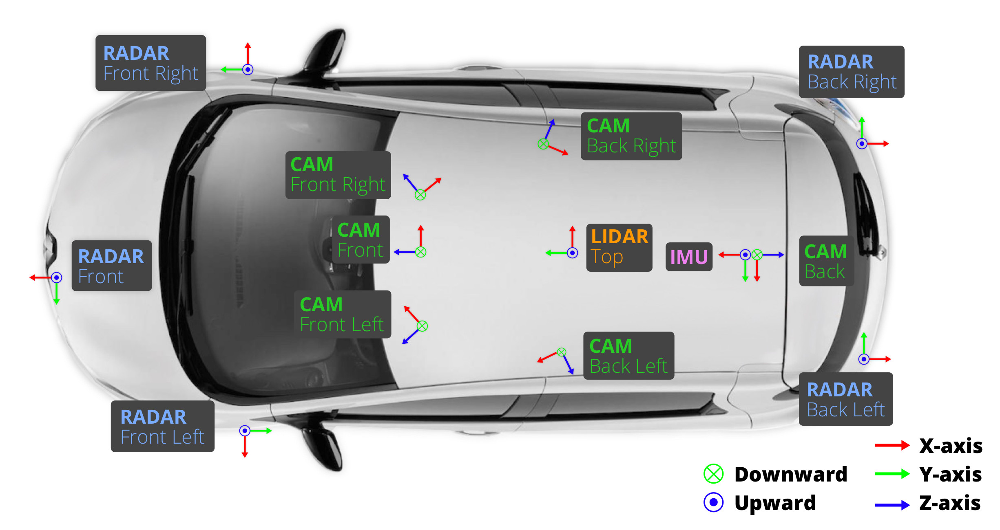  
  *Figure: Sensor installation on the nuScenes data collection vehicle (cameras, LiDAR, radars, GNSS/IMU).*  

#### Map
- High-definition semantic map with **11 layers** (lanes, sidewalks, stop lines, curbs, etc.).  
- Includes **baseline routes** for planning and localization.

#### Semantic HD Map
  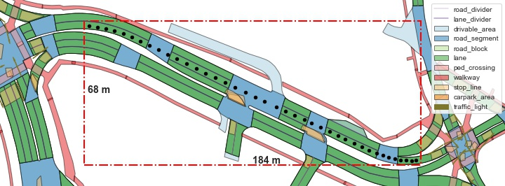  
  *Figure: Example of the semantic HD map used in nuScenes (lanes, sidewalks, crosswalks, stop lines, etc.).*  

---

### Calibration and Synchronization
- **Cross-sensor synchronization**: LiDAR scans trigger camera exposures; motion compensation applied for alignment.  
- **Localization**: LiDAR + odometry particle filter (MCL), achieving ≤10 cm error even in urban canyon GNSS degradation.  
- **Coordinate system**: Vehicle reference frame at rear axle center; global ↔ local transformations supported.

---

### Annotations
- **3D Bounding Boxes**: 23 object classes (cars, pedestrians, bicycles, cones, etc.) with 8 attributes (e.g., vehicle state, pedestrian pose).  
- **Attributes**: e.g., moving/stopped, with rider/without rider.  
- **Intermediate frames**: Provided but unlabeled; useful for tracking and temporal fusion.  
- **Scene descriptions**: Short text annotations describing scenario type (e.g., “night, rainy, intersection, lane change”).

### Camera Field of View (FOV)
  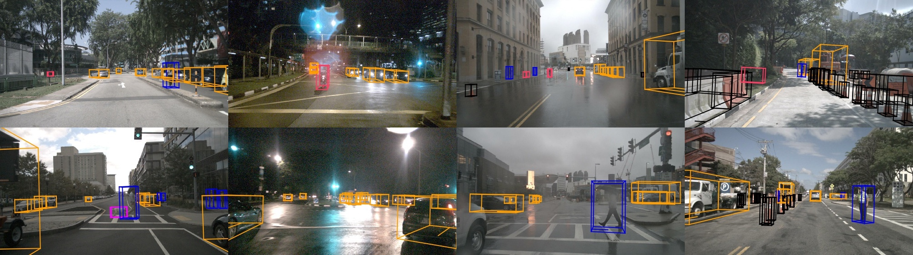  
  *Figure: Camera placement and overlapping FOVs providing 360° coverage.*  

---

### Tasks & Metrics

#### 3D Detection

- **Matching criterion**:  
  Uses **Center Distance (CD)** instead of IoU for matching, which is more appropriate for small or thin objects (e.g., pedestrians, traffic cones).  

- **Metrics**:  
  - **Mean Average Precision (mAP)**:  
    For each class \(c \in C\) and each center distance threshold \(d \in D=\{0.5,1,2,4\}\,\text{m}\), compute \(AP_{c,d}\).  
    Then average over all classes and thresholds:  

    $$
    \text{mAP} = \frac{1}{|C||D|} \sum_{c \in C} \sum_{d \in D} AP_{c,d}
    $$

  - **True Positive (TP) error metrics**:  
    - **mATE**: mean Average Translation Error (position).  
    - **mASE**: mean Average Scale Error (size).  
    - **mAOE**: mean Average Orientation Error (heading).  
    - **mAVE**: mean Average Velocity Error (motion).  
    - **mAAE**: mean Average Attribute Error (class-specific state).  

  - **nuScenes Detection Score (NDS)**:  
    Combines detection quantity (mAP) and quality (5 TP errors):  

    $$
    \text{NDS} = \frac{1}{10} \left[ 5 \cdot \text{mAP} +
    \sum_{\text{mTP} \in \{\text{mATE},\text{mASE},\text{mAOE},\text{mAVE},\text{mAAE}\}}
    \big(1 - \min(1, \text{mTP})\big) \right]
    $$

    - The **mAP term** contributes up to 0.5 of the final score.  
    - Each error metric contributes up to 0.1, penalizing large deviations.  
    - Thus, \(\text{NDS} \in [0,1]\), balancing **recall** (via mAP) and **box quality** (via TP errors).  

#### 3D Tracking
- Uses **sAMOTA / AMOTP** instead of traditional MOTA/MOTP (avoids collapse to 0 in hard scenes).  
- Introduces **TID (Track Initialization Duration)** and **LGD (Longest Gap Duration)**, emphasizing first detection time and robustness against long occlusions.

---

### Baselines & Results
- **PointPillars (LiDAR-only)**:  
  - Single-frame NDS ≈ 31.8%; 10-frame accumulation improves to 44.8%.  
  - mAP rises from 21.9% → 28.8%; velocity error AVE drops from 1.21 → 0.30 m/s.  
- **MonoDIS (Image-only)**:  
  - mAP ≈ 30.4%; NDS ≈ 38.4%, but higher translation/velocity errors.  
- **Challenge leaderboard**:  
  - Megvii (LiDAR): NDS 63.3%, mAP 52.8% (SOTA at the time).  
  - PointPillars: NDS 45.3%.  
  - MonoDIS: NDS 38.4%.

---

### Analysis

#### The case for a large benchmark dataset
- Larger datasets bring **significant improvements**.  
- PointPillars trained on nuScenes with more data clearly outperforms SSD+3D and MonoDIS when compared fairly.  
- Shows that **method ranking depends on dataset size**: some methods look competitive on small datasets (KITTI), but on larger datasets like nuScenes, stronger methods emerge.  
- Confirms that **benchmark size and diversity** are crucial to unlock the potential of complex algorithms.

---

#### The importance of the matching function
- nuScenes uses **Center Distance (CD) matching** instead of IoU.  
- Findings:  
  - **IoU matching** struggles with small objects (pedestrians, bicycles), leading to very low AP.  
  - **Center Distance matching** is more fair for small/thin objects and reorders performance ranking (MonoDIS becomes competitive on bicycles).  
- Conclusion: CD is **more appropriate for ranking** lidar- and image-based methods together.

---

#### Multiple lidar sweeps improve performance
- nuScenes allows use of **0.5s of previous LiDAR sweeps** (≈ 10 sweeps at 20 Hz).  
- Experiment (PointPillars baseline):  
  - Using 1, 5, and 10 sweeps improves detection and velocity prediction.  
  - Gains diminish after ~10 sweeps.  
- Shows the importance of **temporal information** and **motion cues** for robust detection.

---

#### Which sensor is most important?
- **Lidar vs. camera**:  
  - PointPillars (LiDAR) and MonoDIS (image) achieve similar mAP (~30%).  
  - But LiDAR has much higher NDS (45.3% vs 38.4%) → better quality in translation, scal

---

### Key Contributions
- First large-scale **360° multimodal dataset** with cameras, LiDAR, radar, and IMU.  
- Provides **semantic HD maps**.  
- Introduces **new evaluation metrics** (NDS, sAMOTA, TID/LGD).  
- Releases full **DevKit, schema, and reproducible baselines**.

---

### Limitations
- LiDAR range limited (≤70 m), reducing long-distance coverage.  
- Radar annotations and methods still immature at release.  
- Strong long-tail imbalance makes rare-class detection difficult.  
- Only keyframes annotated; intermediate frames unlabeled.
- Data collection conducted in **urban environments with a mean driving speed of 16 km/h**, which limits the dataset’s applicability to highway and high-speed scenarios.

---

## 3. Waymo Open Dataset (CVPR 2020)

**Paper Information**  
- Title: Scalability in Perception for Autonomous Driving: Waymo Open Dataset  
- Conference: CVPR 2020  
- Authors: Pei Sun, Henrik Kretzschmar, Xerxes Dotiwalla, et al.  
- Organization: Waymo LLC & Google LLC  
- Paper: [CVPR 2020 OpenAccess PDF](https://openaccess.thecvf.com/content_CVPR_2020/html/Sun_Scalability_in_Perception_for_Autonomous_Driving_Waymo_Open_Dataset_CVPR_2020_paper.html)  
- Project: [https://waymo.com/open/](https://waymo.com/open/)  
- GitHub: [https://github.com/waymo-research/waymo-open-dataset](https://github.com/waymo-research/waymo-open-dataset)  

---

### Motivation
- Existing datasets (KITTI, nuScenes, Argoverse, etc.) are limited in **scale, coverage, and diversity**, making it difficult to study **generalization across geographies**.  
- Waymo Open Dataset (WOD) was introduced to:  
  - Provide a **large-scale multimodal dataset** with synchronized LiDAR and cameras.  
  - Enable research on **scalability, domain adaptation, and sensor fusion**.  
  - Establish strong **baselines for 2D/3D detection and tracking**.

---

### Dataset Overview

#### Scale & Coverage
- **1150 scenes**, each 20 seconds (10 Hz).  
- Total duration: **6.4 hours**.  
- Coverage: **76 km²**, ~15× larger than nuScenes.  
- Locations: **San Francisco (urban)**, **Phoenix (suburban)**, **Mountain View (suburban)**.  

#### Sensor Setup

- **5 LiDARs**  
  - Mounted at five positions: **top, front, rear, left, and right**.  
  - Provide a dense 3D point cloud with approximately **177,000 points per frame**, which is significantly higher compared to datasets like nuScenes (~34,000 points per frame).  
  - Each LiDAR has an effective **range of up to 75 meters**.  
  - Additional features such as **elongation** and **intensity** are recorded, enabling richer downstream perception tasks.  

- **5 Cameras**  
  - **Positions**: front (F), front-left (FL), front-right (FR), side-left (SL), side-right (SR).  
  - **Resolution**:  
    - Front (F), front-left (FL), front-right (FR): **1920 × 1280** pixels.  
    - Side-left (SL), side-right (SR): **1920 × 1040** pixels.  
  - **Field of View (FOV)**: Each camera provides a **horizontal FOV of ±25.2°** (~50.4° total horizontal coverage).  
  - **Shutter & Sampling**:  
    - All five cameras operate with a **rolling shutter** mechanism.  
    - Rolling shutter timing information is provided for each frame.  
    - Sensor suite operates at a synchronized frequency of **10 Hz**, with sequence lengths up to **20 seconds**.  
  - **Time Synchronization with LiDAR**:  
    - Camera frames are temporally aligned with LiDAR scans, with synchronization error bounded to within **[−6 ms, +7 ms] at 99.7% confidence**, and **[−6 ms, +8 ms] at 99.9995% confidence**.  
    - Rolling shutter compensation is supported when projecting LiDAR points into the camera frame, ensuring high-precision sensor fusion.  

---

### Sensor Setup Illustration
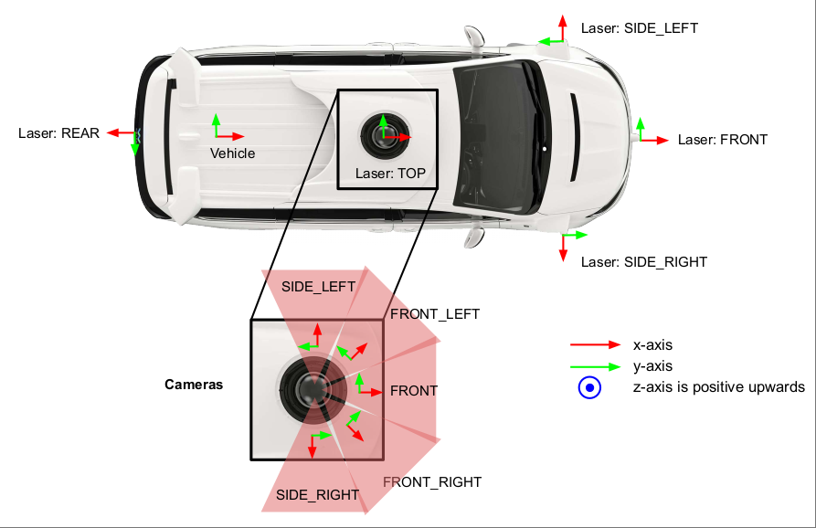
*Figure: Waymo vehicle sensor suite — 5 LiDARs (top, front, rear, left, right) and 5 cameras (front, front-left, front-right, side-left, side-right).*

---

#### Coordinate Systems

All coordinate systems in the dataset follow the **right-hand rule**, and the dataset provides the necessary transformations between any two frames within a run segment.

- **Global Frame**  
  - Defined prior to vehicle motion.  
  - East-North-Up (ENU) coordinate system:  
    - **z-axis**: aligned with gravity, positive upward.  
    - **x-axis**: points east along the line of latitude.  
    - **y-axis**: points north toward the north pole.  
  - Used as a proxy for transforming between different vehicle frames.  

- **Vehicle Frame**  
  - Moves with the vehicle.  
  - **x-axis**: forward (driving direction).  
  - **y-axis**: left.  
  - **z-axis**: upward.  
  - Vehicle pose is expressed as a 4×4 transformation matrix from the vehicle frame to the global frame.  

- **Sensor Frame**  
  - Each sensor (LiDAR or camera) has its own local frame.  
  - Defined by a 4×4 extrinsic transformation matrix mapping sensor coordinates to the vehicle frame.  
  - **LiDAR frame**:  
    - Origin at LiDAR center.  
    - **z-axis** pointing upward.  
    - **x- and y-axes** orientation depends on LiDAR placement.  
  - **Camera frame**:  
    - Origin at the camera’s optical center.  
    - **x-axis**: points along the lens barrel outward.  
    - **z-axis**: points upward.  
    - **y/z-plane** is parallel to the image plane.  

- **Image Frame**  
  - A 2D pixel coordinate system for each camera image.  
  - **+x**: increases along image width (columns from left to right).  
  - **+y**: increases along image height (rows from top to bottom).  
  - Origin: top-left corner of the image.  

- **LiDAR Spherical Coordinate System**  
  - Derived from the LiDAR Cartesian frame.  
  - A 3D point (x, y, z) in Cartesian coordinates can be uniquely mapped to spherical coordinates (range, azimuth, inclination):  
    - **Range**:  
      \[
      r = \sqrt{x^2 + y^2 + z^2}
      \]  
    - **Azimuth**:  
      \[
      \theta = \text{atan2}(y, x)
      \]  
    - **Inclination**:  
      \[
      \phi = \text{atan2}(z, \sqrt{x^2 + y^2})
      \]  

#### Dataset Splits
- Training: 798 scenes  
- Validation: 202 scenes  
- Test: 150 scenes (geographic holdout, unseen areas)

---

#### Ground Truth Labels

The dataset provides **high-quality ground truth annotations** for both LiDAR point clouds and camera images. Annotations are designed to be consistent across modalities, supporting multi-sensor fusion research.

- **3D LiDAR Bounding Boxes**  
  - Objects include **vehicles, pedestrians, cyclists, and traffic signs**.  
  - Each object is represented as a **7-DOF 3D upright bounding box**:  
    \[
    (c_x, c_y, c_z, l, w, h, \alpha)
    \]  
    where \((c_x, c_y, c_z)\) are the center coordinates, \(l, w, h\) are length, width, height, and \(\alpha\) is the heading angle in radians.  
  - Bounding boxes are assigned a **unique tracking ID**.  
  - Total: **12 million labeled objects** and **113k annotated object tracks**.  

- **2D Camera Bounding Boxes**  
  - Vehicles, pedestrians, and cyclists are also annotated in images.  
  - Each object is represented by a **4-DOF 2D axis-aligned bounding box**:  
    \[
    (c_x, c_y, l, w)
    \]  
    where \((c_x, c_y)\) are the pixel coordinates of the box center, \(l\) is the box length along the horizontal axis, and \(w\) is the box width along the vertical axis.  
  - This encoding is designed to complement the 3D bounding boxes and their amodal 2D projections.  
  - Total: **12 million labeled objects** and **254k annotated object tracks**.  

- **Difficulty Levels**  
  - Following the KITTI convention, two difficulty levels are provided: **LEVEL_1** (easier) and **LEVEL_2** (harder).  
  - LEVEL_2 includes all LEVEL_1 samples.  
  - Criteria for difficulty are based on both **human labelers** and **object statistics**.  

- **Quality Assurance**  
  - All LiDAR and camera labels were manually annotated by **experienced human annotators** using industrial-strength labeling tools.  
  - Multiple phases of label verification were conducted to ensure **high consistency and accuracy**.  

---

### 3D Object Labels in LiDAR Point Clouds
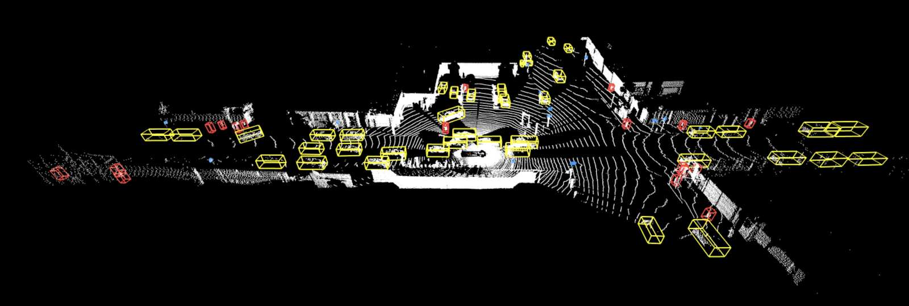
*Figure: Example of Waymo LiDAR point cloud annotations with 7-DOF 3D bounding boxes for vehicles, pedestrians, cyclists, and traffic signs.*

---

### Point Cloud and Image Projection
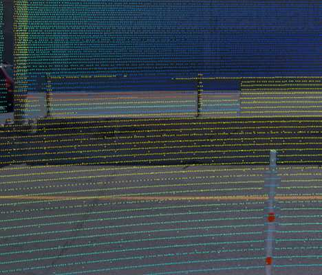
*Figure: Waymo dataset example — LiDAR points projected onto a camera image for cross-sensor fusion.*

---

### Tasks & Metrics

#### 3D Object Detection
- Predict upright 3D bounding boxes for vehicles, pedestrians, cyclists, and signs.  
- **Metrics**:  

\[
AP = 100 \int_0^1 \max \{ p(r') \mid r' \geq r \} \, dr
\]  

\[
APH = 100 \int_0^1 \max \{ h(r') \mid r' \geq r \} \, dr
\]  

---

#### 2D Object Detection
- Restricted to **camera images only**.  
- Metric: **AP** with **2D IoU** matching (same definition as above).  

---

#### Object Tracking
- Multi-Object Tracking (MOT) in both 2D and 3D.  
- **Metrics**:  

\[
MOTA = 100 - 100 \frac{\sum_t (m_t + fp_t + mme_t)}{\sum_t g_t}
\]  

\[
MOTP = 100 \frac{\sum_{i,t} d^i_t}{\sum_t c_t}
\]  

---

### Baseline Results
- **3D Detection (LiDAR)**:  
  - PointPillars baseline: Vehicle APH ≈ 62.8 (Level 1).  
- **2D Detection (Camera)**:  
  - Faster R-CNN (ResNet-101): Vehicle AP ≈ 63.7 (Level 1).  
- **3D Tracking**:  
  - Vehicle MOTA ≈ 42.5.  
- **2D Tracking**:  
  - Tracktor baseline, Vehicle MOTA ≈ 34.8.  

---

### Experiments & Analysis

#### Domain Gap
- **Cross-city generalization is difficult**:  
  - Training on San Francisco, testing on Phoenix → Vehicle APH −8.0.  
  - Training on Phoenix, testing on San Francisco → Vehicle APH −7.6.  
- Indicates **domain adaptation** is a key challenge.  

#### Dataset Size Effect
- More data → consistently better results.  
- Training with 10% vs 100% data: Vehicle APH improved from ~29.7 → 49.8.  
- Confirms **scalability of perception performance with dataset size**.  

---

### Key Contributions
- **Largest multimodal camera-LiDAR dataset** at release.  
- Introduced **APH metric** for heading-aware detection evaluation.  
- Provided **baselines for 2D/3D detection and tracking**.  
- Demonstrated **domain gap problem** and **scalability benefits** of larger datasets.  

---

### Limitations
- Coverage limited to 3 U.S. cities.  
- LiDAR range limited to 75 m (shorter than some newer datasets).  
- No semantic HD maps provided (unlike nuScenes/Argoverse).  
- Weather diversity is relatively low (mostly clear conditions).  

---

## 4. OpenOccupancy (ICCV 2023)

**Paper Information**  
- Title: [OpenOccupancy: A Large Scale Benchmark for Surrounding Semantic Occupancy Perception](https://github.com/JeffWang987/OpenOccupancy)  
- Conference: ICCV 2023  
- Authors: Xiaofeng Wang, Zheng Zhu, Wenbo Xu, et al.  
- Organizations: CASIA, PhiGent Robotics, UCAS, Tsinghua University  

---

### Motivation
- Current benchmarks mainly focus on:  
  - **3D object detection** → foreground objects only.  
  - **LiDAR segmentation** → sparse points, incomplete structure.  
- **Limitations**:  
  - Most datasets limited to **front-view occupancy**.  
  - SemanticKITTI: small scale, limited diversity, lacks full surround-view evaluation.  
- **Goal**: Introduce **OpenOccupancy**, the first **surround-view semantic occupancy benchmark**, to support dense 3D perception for autonomous driving.

---

### Dataset Overview: nuScenes-Occupancy
- Built upon **nuScenes dataset**, extended with dense occupancy labels.  
- **Annotation pipeline (AAP: Augmenting And Purifying)**:  
  1. Multi-frame LiDAR accumulation → coarse labels.  
  2. Train baseline to produce pseudo labels.  
  3. Fuse initial & pseudo labels.  
  4. Human refinement (~4000 hours) → high-quality ground truth.  

- **Statistics**:  
  - ~2× denser labels than initial annotation (~400K voxels per frame).  
  - **17 semantic classes** (vehicles, pedestrians, drivable area, sidewalk, vegetation, etc.).  
  - **28130 training frames**, **6019 validation frames**.  
  - Voxel resolution: **0.2 m**, volume: **40 × 512 × 512**.  

---

### Annotation Comparison

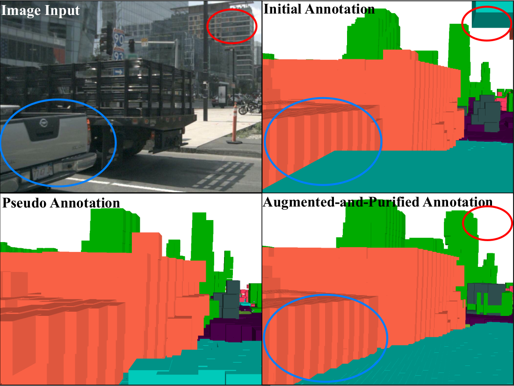  
*Figure: Comparison of initial, pseudo, and augmented-and-purified annotations in OpenOccupancy.*

---

### Evaluation Protocol
- **Metrics**:  
  - **IoU**: occupancy accuracy.  
  - **mIoU**: per-class mean IoU over 17 categories.  

---

### Baselines

1. **LiDAR-based**  
   - Voxelization + sparse 3D conv.  
   - Performs well for large-scale structures (road, sidewalk).  

2. **Camera-based**  
   - ResNet + FPN backbone → 2D-to-3D view transformation.  
   - Better for small objects (pedestrians, bicycles).  

3. **Multi-modal**  
   - Adaptive fusion of LiDAR + camera features.  
   - Outperforms single modalities: **+46% (camera), +34% (LiDAR)** mIoU.  

---

### Baseline Architectures

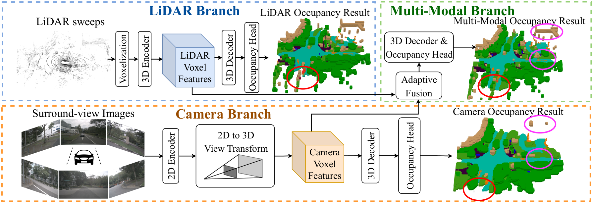  
*Figure: Overall architecture of three proposed baselines in OpenOccupancy.*  

---

### Cascade Occupancy Network (CONet)
- **Problem**: Surround-view covers ~5× perceptive range vs front-view; direct high-res prediction is too costly.  
- **Solution**: Coarse-to-fine design.  
  - Step 1: Coarse low-res occupancy prediction.  
  - Step 2: Refine only predicted occupied voxels at high resolution.  
- **Benefit**:  
  - ~30% performance gain.  
  - Reduced GPU memory & FLOPs compared to naive high-res.  

---

### Cascade Occupancy Network

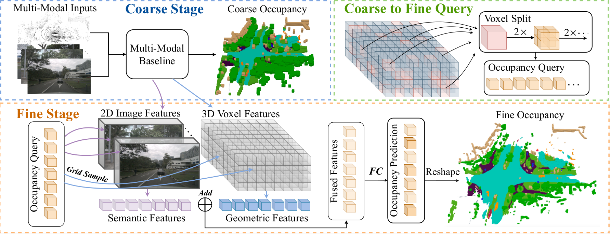  
*Figure: Overall framework of the multi-modal Cascade Occupancy Network (CONet).*  

---

### Experiments & Analysis
- **Camera baseline** improves MonoScene by +51% mIoU.  
- **LiDAR baseline** surpasses RGBD-based methods.  
- **Multi-modal fusion** gives best performance:  
  - LiDAR handles large objects.  
  - Camera helps small objects.  
- **CONet** improves all baselines:  
  - Camera: +25% mIoU.  
  - LiDAR: +34% mIoU.  
  - Multi-modal: +29% mIoU.  

---

### Semantic Occupancy Predictions
Visualization of the semantic occupancy predictions.  
- 1st row: surround-view images.  
- 2nd & 3rd rows: coarse and fine occupancy generated by the multi-modal baseline and multi-modal CONet (camera view).  
- 4th row: global-view predictions comparison.  

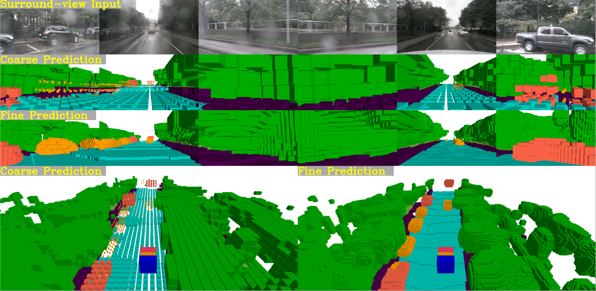  
*Figure: Visualization of semantic occupancy predictions in OpenOccupancy.*  

---

### Key Contributions
- First **surround-view semantic occupancy benchmark**.  
- Released **nuScenes-Occupancy dataset** with dense 3D labels (via AAP pipeline).  
- Established **camera, LiDAR, and multi-modal baselines**.  
- Proposed **CONet**, an efficient coarse-to-fine network improving accuracy and efficiency.  

---

### Limitations
- Built upon nuScenes → inherits its limited driving speed (~16 km/h average).  
- Computational demands still high for real-time deployment.  
- Long-tail classes remain challenging (rare objects under-represented).  
