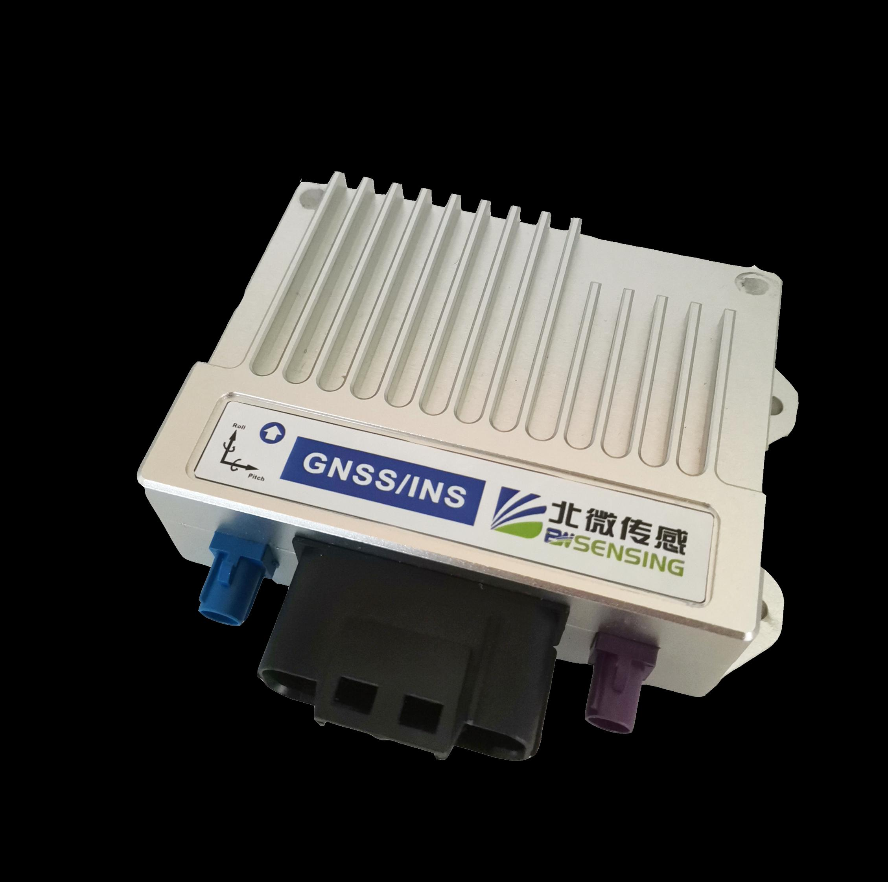
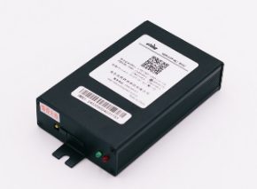

# 北微传感 GI320 组合导航系统说明

## 1. 基本情况
- **主设备**：北微传感 GI320 组合导航板卡  
- **扩展模块**：4G DTU 通信模块  
- **主要功能**：
  - GNSS/INS 高精度组合导航
  - 双天线，支持高精度航向解算
  - 以太网 / CAN / 串口多接口输出
  - 外接 4G 模块实现远程数据上传 & CORS 差分接收（千寻位置）

---

## 2. 供电与功耗
### GI320 组合导航
- **输入电压**：DC 9–36V  
- **功耗**：约 **5 W**（典型值）  
- **天线馈电**：5V DC / 200 mA（有源天线）  
- **推荐供电**：车载电源 / 稳压电源，带保险丝  

### GI320 组合导航板卡

### 4G DTU 模块
- **输入电压**：DC +5 ~ +36V（宽电压输入）  
- **工作电流**：
  - 410 mA @ +5V DC  
  - 170 mA @ +12V DC  
- **待机电流**：
  - 220 mA @ +5V DC  
  - 100 mA @ +12V DC  
- **功耗**：约 **2 W**（典型工作状态）  
- **接口**：RS232/RS485 + DB9

### 4G DTU 模块

### 系统总功率
- **GI320** ≈ 5 W  
- **4G 模块** ≈ 2 W  
- **总功率需求** ≈ **7 W**  
- 建议电源预留 ≥10 W，保证稳定运行  

---

## 3. 网络与 CORS
- **基站服务**：千寻位置 CORS  
- **接入方式**：4G 模块连接运营商网络 → 获取 RTCM 差分 → 输入 GI320  
- **支持频段**：
  - TDD-LTE: B34/B38/B39/B40/B41  
  - FDD-LTE: B1/B3/B8  
  - GSM/EDGE: 900/1800 MHz  
- **差分数据**：RTCM 3.x  

---

## 4. 接口说明
### GI320 主板
- **串口**：RS232/RS422/RS485  
- **CAN FD**：两路，可输出组合导航数据  
- **以太网**：TCP/UDP 调试 & 数据流  
- **PPS 输出**：时间同步  

### 4G 模块
- **接口**：RS232 / RS485  
- **供电**：独立电源输入（推荐 12V DC）  
- **网络制式**：2G/3G/4G 全网通  

---

## 5. 输出数据
- **GNSS 定位数据**：NMEA GNGGA、RMC 等  
- **INS 解算数据**：INSPVA / INSPVB（位置、速度、姿态）
- **IMU 原始数据**：RAWIMU（加速度、角速度）  
- **时间同步**：1PPS + NMEA  

---

## 6. 使用注意事项
1. **电源设计**：  
   - 建议 GI320 与 4G 模块共用同一电源系统，但独立分支、各自保险。  
   - 额定 ≥10 W 输出，避免瞬态电流不足。  
2. **天线安装**：  
   - 双 GNSS 天线需保持 ≥1 m 间距，固定于同一水平面。  
   - 4G 天线避免与 GNSS 天线过近，减少干扰。  
3. **CORS 使用**：  
   - 确认千寻账号有效并开通服务。  
   - 检查 4G 网络信号稳定性。  
4. **散热**：  
   - GI320 和 4G 模块长时间工作需保证通风散热。  

