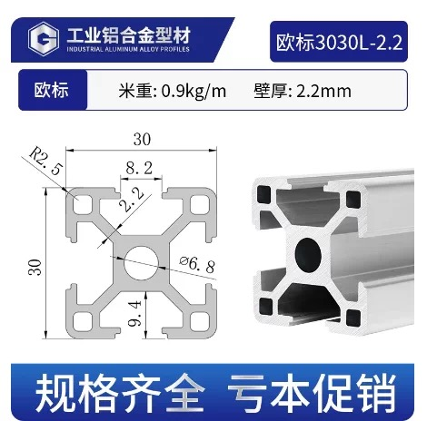
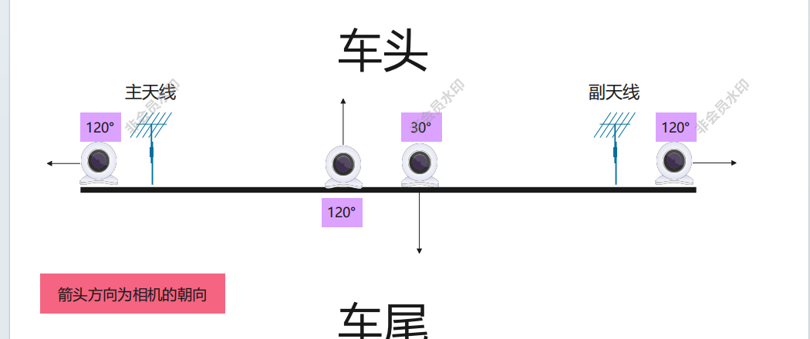

# Exterior Data-Collection Equipment Installation Procedure

This document records the installation procedure for exterior data-collection equipment, including the aluminum-profile support, suction cups, antenna rods, and cameras. The installation must prioritize structural stability, correct viewing angles, cable safety, and resistance to vibration during vehicle operation.

## 1. Basic Record Information

| Item | Details |
|------|---------|
| Record name | Exterior equipment installation procedure |
| Applicable use | Exterior vehicle data-collection equipment installation |
| Aluminum profile | European-standard 3030L-2.2, 1 m |
| Main fasteners | M6 screws |
| Antenna-rod length | 4.5 cm |
| Fixing method | Screw fastening with adhesive reinforcement |

## 2. Purpose and Overall Description

This procedure standardizes the installation of exterior data-collection equipment. A 1 m European-standard 3030 aluminum profile is used as the mounting base. A suction cup fixes the lower end to the vehicle, an antenna rod is installed at the upper end, and cameras are mounted at designated positions along the profile.

After installation, confirm that the suction cups, screws, antenna rods, camera mounts, and cables are all secure, and that the camera views cover the required front, rear, left, and right directions.

## 3. Materials and Tools

| Category | Name/specification | Purpose | Precautions |
|----------|--------------------|---------|-------------|
| Structural component | 1 m European-standard 3030L-2.2 aluminum profile | Exterior equipment mounting base | Confirm the slot, center-hole, and M6 screw compatibility |
| Fastener | Suction cup + M6 screw | Attach the profile to the exterior of the vehicle | Check suction force and screw tightness after installation |
| Reinforcement material | Adhesive or threadlocker | Improve vibration resistance at the suction cup, antenna rod, and camera-base connections | Clean contact surfaces before applying adhesive |
| Antenna component | 4.5 cm antenna rod | Mount the exterior antenna | Cut, deburr, and drill the rod with appropriate equipment |
| Collection equipment | Camera and mount/base | Capture front, rear, left, and right views | Apply adhesive reinforcement after fixing the camera base |
| Tools | Machine tool, drilling tools, wrenches, etc. | Cutting, drilling, and fastening | Follow appropriate machining and installation safety procedures |

## 4. Installation Procedure

### 4.1 Prepare the Aluminum-Profile Base and Install the Suction Cup

1. Prepare a 1 m European-standard 3030L-2.2 aluminum profile and check it for deformation, burrs, or damaged slots.
2. Install a suction cup at the lower end of the profile. Connect the suction cup to the profile with an M6 screw and tighten it fully.
3. After confirming that there is no obvious movement between the suction cup and profile, apply adhesive at the connection to improve the fixing strength and reduce loosening caused by vehicle vibration.
4. Do not move the connection before the adhesive cures. After curing, check the connection between the suction cup, screw, and aluminum profile again.

### 4.2 Process and Fix the Antenna Rod

1. Cut the antenna rod to 4.5 cm. Keep the cut face as flat as possible and remove all burrs.
2. Drill the designated hole in the antenna rod so that it aligns with the mounting position at the top of the aluminum profile.
3. Use an M6 screw to fix the antenna rod to the top of the profile. Confirm that its direction meets the experimental requirements.
4. If vehicle vibration is significant, apply adhesive or threadlocker to the threaded connection to improve vibration resistance.

### 4.3 Install the Cameras and Adjust Their Angles

1. Install each camera and its mount/base at the designated position on the aluminum profile. Select the position according to the collection requirement, such as a front, rear, left-side, or right-side view.
2. Apply adhesive reinforcement after fixing each camera base to reduce angle drift caused by vehicle vibration.
3. Adjust the camera direction so that the image covers the target area without obstruction from the vehicle body, antenna rod, or other structures.
4. Tighten the camera-mount connections and check for visible movement.
5. Route and secure the camera cables so that they cannot be pulled or swing during driving and do not affect driving safety.
6. Power the cameras and confirm that the images are normal, the angles are appropriate, and the views are unobstructed.

## 5. Camera and Antenna Positioning

The aluminum profile is recorded as 1 m long. The distances below use the profile ends as references for field installation and later reproduction. Mark all positions before fixing the mounts and antenna rods, then apply adhesive reinforcement.

| Component | Reference | Position | Installation note |
|-----------|-----------|----------|------------------|
| Left camera | Left end of the aluminum profile | 3 cm | Adjust to the left-side collection view and apply adhesive to the base. |
| Main antenna | Left camera | 5 cm | Install near the right side of the left camera and fix the rod with an M6 screw. |
| Forward-facing camera | Left end of the aluminum profile | 45 cm | Point the lens toward the front of the vehicle and apply adhesive to the base. |
| Right camera | Right end of the aluminum profile | 3 cm | Adjust to the right-side collection view and apply adhesive to the base. |
| Secondary antenna | Right camera | 5 cm | Install near the left side of the right camera and fix the rod with an M6 screw. |
| Rear-facing camera | Left end of the aluminum profile | 45 cm | Point the lens toward the rear and apply adhesive to the base. If installed alongside the forward-facing camera, adjust for the mount width to avoid obstruction or interference. |

After positioning, confirm that the left, right, forward, and rear camera views match the experimental design and that no lens is blocked by the antenna rod, vehicle edge, or cables. Do not repeatedly adjust a camera after applying adhesive until the adhesive has fully cured. If adjustment is necessary, recheck the base strength.

## 6. Installation Completion Checklist

| Check item | Acceptance criterion | Result |
|-----------|----------------------|--------|
| Suction-cup fixing | The suction cup is firmly attached to the vehicle surface with no looseness | □ Pass  □ Needs correction |
| M6 screws | All screws are tight with no stripped threads or looseness | □ Pass  □ Needs correction |
| Suction-cup adhesive | Adhesive has been applied and the cured connection is stable | □ Pass  □ Needs correction |
| Antenna rod | The rod is secure and its direction meets the experiment requirements | □ Pass  □ Needs correction |
| Camera positioning | Left, right, forward, and rear camera positions match the recorded dimensions | □ Pass  □ Needs correction |
| Camera-base adhesive | Adhesive reinforcement is complete and the cured base has no looseness | □ Pass  □ Needs correction |
| Camera views | Images are normal, unobstructed, and cover the target areas | □ Pass  □ Needs correction |
| Camera mounts | Mounts are secure and show no obvious shake during a low-speed vibration check | □ Pass  □ Needs correction |
| Cable routing | Cables are secured and do not affect doors, windows, or driving safety | □ Pass  □ Needs correction |
| Pre-road-test confirmation | The vehicle passes a low-speed check before formal data collection | □ Pass  □ Needs correction |

## 7. Short Form of the Procedure

Prepare the 1 m European-standard 3030 aluminum profile → install the lower suction cup → fasten with an M6 screw → apply adhesive at the suction-cup connection → cut the antenna rod to 4.5 cm → drill the antenna rod → fix it to the top of the profile with an M6 screw → mark camera and antenna positions → install and adjust the cameras → apply adhesive to the camera bases → secure the cables → complete the overall stability check → begin road data collection.

## 8. Notes

- Clean the vehicle suction area and the aluminum-profile connection area before installation. Dust, water, or oil can reduce the effectiveness of the suction cup and adhesive.
- Complete a low-speed stability check for all exterior structural components before formal collection.
- Save one screenshot from each camera after installation as a record of the confirmed view.
- Protect exterior equipment against water ingress and loosening, and protect all cables.
- This procedure covers mechanical installation only. Camera calibration, time synchronization, and data-collection software configuration must be documented separately.
