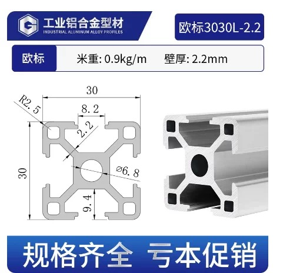
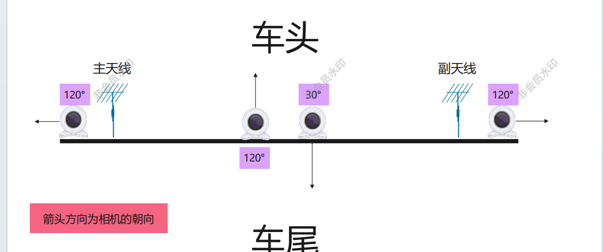

# 车外数据采集设备安装流程记录

本文档用于记录车外数据采集设备的安装流程，适用于车外铝型材支架、吸盘、天线杆与摄像头的安装存档。安装过程中应重点保证结构稳定、视角正确、线缆安全，以及车辆行驶过程中的抗振可靠性。

---

## 1. 基本记录信息

| 项目 | 内容 |
|------|------|
| 记录名称 | 车外设备安装流程 |
| 适用场景 | 车辆外部数据采集设备安装 |
| 铝型材规格 | 欧标 3030L-2.2，1 m |
| 主要紧固件 | M6 螺钉 |
| 天线杆长度 | 4.5 cm |
| 固定方式 | 螺钉固定 + 打胶增强 |

---

## 2. 安装目的与整体说明

本流程用于规范记录车外数据采集设备的安装方法。设备主体以 1 m 长欧标 3030 铝型材作为安装基座，下端通过吸盘与车身固定，上端安装天线杆，并在铝型材指定位置安装摄像头。

安装完成后，应确认吸盘、螺钉、天线杆、摄像头支架和线缆均固定可靠，摄像头视角满足前、后、左、右方向的数据采集需求。

---

## 3. 主要材料与工具

| 类别 | 名称/规格 | 用途 | 注意事项 |
|------|-----------|------|----------|
| 结构件 | 1 m 欧标 3030L-2.2 铝型材 | 作为车外设备安装基座 | 确认槽口、中心孔位和 M6 螺钉适配 |
| 固定件 | 吸盘 + M6 螺钉 | 将铝型材固定在车身外部 | 安装后需检查吸附力和螺钉松动情况 |
| 加固材料 | 胶水或螺纹胶 | 增强吸盘、天线杆和摄像头底座连接处的抗振稳定性 | 打胶前清洁接触面，避免灰尘和油污 |
| 天线部件 | 4.5 cm 天线杆 | 固定外部天线 | 需要机床切割、去毛刺并打孔 |
| 采集设备 | 摄像头及支架/底座 | 采集前、后、左、右视角视频数据 | 摄像头底座固定后需打胶加固 |
| 工具 | 机床、钻孔工具、扳手等 | 切割、打孔、紧固 | 加工和安装时注意安全防护 |

---

## 4. 安装流程

### 4.1 铝型材基座准备与吸盘安装

1. 准备 1 m 长欧标 3030L-2.2 铝型材，检查型材是否存在变形、毛刺或槽口损伤。
2. 在铝型材下端安装吸盘。吸盘通过 M6 螺钉与铝型材连接，螺钉应拧紧到位。
3. 确认吸盘与铝型材之间无明显晃动后，在连接位置进行打胶处理，增强固定强度，降低车辆行驶振动导致松动的风险。
4. 胶水固化前避免移动连接件；固化后再次检查吸盘、螺钉和铝型材的连接稳定性。

### 4.2 天线杆加工与上端固定

1. 将天线杆加工至 4.5 cm 长度。切割应尽量保证端面平整，切割完成后清理毛刺。
2. 在天线杆指定位置进行打孔，孔位需与铝型材上端安装位置对应。
3. 使用 M6 螺钉将天线杆固定在铝型材上端。固定后检查天线杆方向是否满足实验设计要求。
4. 如车辆行驶振动较明显，可在螺纹连接处增加胶水或螺纹胶，提高抗振可靠性。

### 4.3 摄像头安装与角度调整

1. 在铝型材指定位置安装摄像头及其支架/底座。安装位置应根据采集需求确定，例如前向、后向、左侧或右侧视角。
2. 摄像头底座固定后需要打胶加固，增强底座与铝型材之间的连接稳定性，降低车辆行驶振动导致摄像头角度偏移的风险。
3. 调整摄像头朝向，确保画面覆盖目标区域，避免被车身、天线杆或其他结构遮挡。
4. 拧紧摄像头支架连接件，检查摄像头是否存在明显晃动。
5. 整理并固定摄像头线缆，避免线缆在车辆行驶过程中拉扯、摆动或影响驾驶安全。
6. 完成通电检查，确认摄像头画面正常、角度合理、图像无遮挡。

---

## 5. 摄像头与天线安装定位

铝型材长度按 1 m 记录，以下距离均以铝型材端部作为基准，用于现场安装定位与后续复现。安装时应先完成位置标记，再固定支架和天线杆，最后进行打胶加固。

| 部件 | 安装基准 | 定位距离 | 安装说明 |
|------|----------|----------|----------|
| 左摄像头 | 铝型材左端 | 3 cm | 安装后调整为左侧采集视角，底座打胶固定。 |
| 主天线 | 左摄像头 | 5 cm | 安装在左摄像头右侧附近，天线杆用 M6 螺钉固定。 |
| 朝前摄像头 | 铝型材左端 | 45 cm | 镜头朝向车头方向，底座打胶固定。 |
| 右摄像头 | 铝型材右端 | 3 cm | 安装后调整为右侧采集视角，底座打胶固定。 |
| 副天线 | 右摄像头 | 5 cm | 安装在右摄像头左侧附近，天线杆用 M6 螺钉固定。 |
| 朝后摄像头 | 铝型材左端 | 45 cm | 镜头朝向车尾方向，底座打胶固定；如与朝前摄像头并列安装，应根据支架宽度微调，避免遮挡和干涉。 |

定位完成后，应检查左、右、前、后摄像头视角是否与实验设计一致，并确认镜头不会被天线杆、车身边缘或线缆遮挡。摄像头底座打胶后，在胶水完全固化前不应频繁调整角度；确需调整时，应重新检查底座固定强度。

---

## 6. 安装完成检查表

| 检查项目 | 合格标准 | 结果记录 |
|----------|----------|----------|
| 吸盘固定 | 吸盘与车身表面贴合牢固，无松动 | □ 合格  □ 待整改 |
| M6 螺钉 | 全部螺钉拧紧，无滑丝或松动 | □ 合格  □ 待整改 |
| 吸盘打胶 | 吸盘连接处已打胶，胶水固化后连接稳定 | □ 合格  □ 待整改 |
| 天线杆 | 天线杆固定牢靠，方向符合实验要求 | □ 合格  □ 待整改 |
| 摄像头定位 | 左/右/前/后摄像头安装位置符合记录尺寸 | □ 合格  □ 待整改 |
| 摄像头底座打胶 | 摄像头底座已完成打胶加固，固化后无松动 | □ 合格  □ 待整改 |
| 摄像头视角 | 画面正常，无遮挡，覆盖目标区域 | □ 合格  □ 待整改 |
| 摄像头支架 | 支架固定可靠，低速晃动测试无明显抖动 | □ 合格  □ 待整改 |
| 线缆整理 | 线缆已固定，不影响车门、车窗和驾驶安全 | □ 合格  □ 待整改 |
| 路测前确认 | 车辆低速行驶检查无异常后，方可正式采集 | □ 合格  □ 待整改 |

---

## 7. 流程简表

1 m 欧标 3030 铝型材准备 → 下端安装吸盘 → M6 螺钉固定 → 吸盘连接处打胶 → 加工 4.5 cm 天线杆 → 天线杆打孔 → M6 螺钉固定在铝型材上端 → 标记摄像头与天线安装位置 → 安装摄像头并调整视角 → 摄像头底座打胶 → 固定线缆 → 完成整体稳定性检查 → 正式道路数据采集。

---

## 8. 注意事项

- 车外设备安装前，应清洁车身吸附区域和铝型材连接区域，避免灰尘、雨水或油污影响吸盘与胶水固定效果。
- 所有外部结构件必须在正式采集前完成低速行驶稳定性检查。
- 摄像头安装完成后，应保存一次各摄像头画面截图，作为视角确认记录。
- 如设备安装在车辆外部暴露位置，应注意防水、防松动和线缆保护。
- 本流程仅记录设备机械安装步骤；摄像头标定、时间同步、数据采集软件配置应另行记录。
